## Branches and flow organization
StandardPackage repository is organized according to the diagram below.

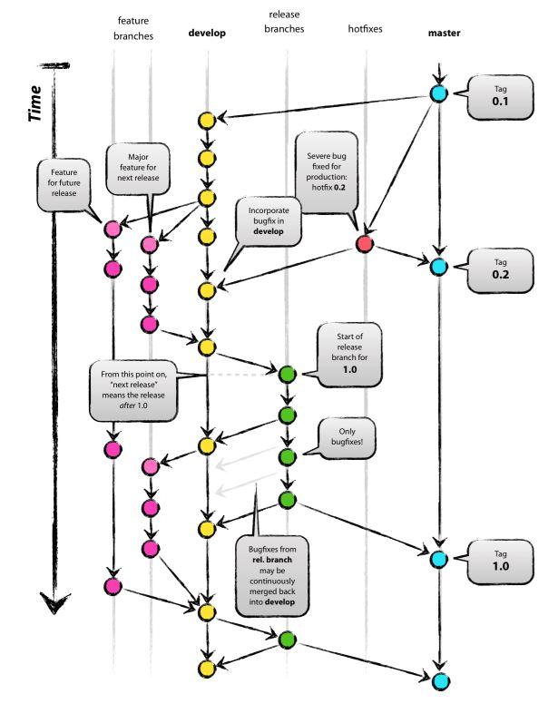

This diagram shows how branches connect to each other over time and what are they meant for.
At the core of the process there are two main, infinite in time, branches: `master` and `develop`.   
All other branches are used to support these two.

&nbsp;
#### Master branch
`master` is the main branch which will have only the accepted code. 
This branch will be managed by repository administrators and any addition will need to follow several rules:

* Merges to the `master` branch can only be made through pull requests on the server.
* Pull requests to the `master` branch can only be made by the `release` branch or a `hotfix` branch.  
Administrators will decide when it is a good time to perform one new major release to the `master` branch. 
* Any pull request from a personal branch or from `develop` branch to the `master` branch must be rejected.
* ToDo’s are not allowed in this branch. If there is some functionality one thinks that can be added in the future, add its description in a “Future” section in the docstring
* Code in this branch should also have Unittests attached.
* The administrator that releases a version into the `master` branch should also create a new version of the package and upload it to Nexus

&nbsp;
#### Develop branch
The `develop` branch is the main branch where the code reflects the latest additions/features for the next release.  
When the source code on this branch is considered to be stable and close to ready to be released it should be merged to the `master` branch with the support of a `release` branch.

*Additional remarks:*

* Anyone can add a new feature to the development branch, but one should not add unfinished features to it. These will be rejected further on between the `release` and the `master` branches and will only make other functionalities already added to `develop` to take longer to be approved into the `master` branch.
* Make sure a pull request of a new feature doesn’t delete features already added by other users to the `develop` branch. Before merging to the `develop` branch, you should pull the current `develop` into the `feature` branch (rebasing your changes on top of the `develop` branch pull) and re-run all necessary tests. Only then the merge should be completed
* If using the command line add the `--no-ff` command to the merge to ensure changes are traceable to their own branches. (in Pycharm/IntelliJ this happens by default when merging)

&nbsp;
#### Feature branches
`feature` branches are used to develop new features for a future release. 

*Additional remarks:*

* It is recommended these are temporary small branches dedicated to a single feature to be easier to merge it back into the `develop`. After merging, they can be deleted. 
* One can create a `feature` branch and include several features (though try to separate them at least on commits within that branch), but be aware that bigger pulls take longer to be reviewed/approved and the probability of being rejected is also higher (due to more code being delivered).
* `Feature` branches should always be created from the latest version of the `develop` branch, and should always merge back to it (or if the work is to be discarded, deleted). Normally their name should be related to the feature being added and should avoid the following names for the obvious reason of avoiding confusion: `master`, `develop`, `release-*` or `hotfix-*`.
* These branches usually only exist in the developer/user repo and not in the `upstream` repo (more on this later).

&nbsp;
#### Hotfix branches
`hotfix` branches are temporary branches destined solely to corrections to already released code. 

*Additional remarks:*

* Hotfixes need to be justified correctly.
* Any change made in a `hotfix` branch needs also to be incorporated to the `develop` branch and to any existent `release` branch. 
* Any person can create a `hotfix` branch, but it needs to always be created from the `master` branch.
* Functionalities should not be added in a `hotfix` branch.

&nbsp;
#### Release branches
Over time, new functions and code will be developed and finished by users and the `develop` branch will be updated frequently.  
Every now and then it is necessary to incorporate these new developments into the `master` branch. For this reason, in a production environment, it is useful to create support `release` branches where finished additions can be gathered before they are released to the `master` branch.  

This is a branch to have the last edges sharpen and add that last minute line of code, but major changes from the `develop` branch should be avoided.  
In this repo situation it is also the time to add any missing unittests and to create/update the `requirements.txt` existing on each folder. After merging to the `master` branch and back to the `develop` branch (to ensure the small changes are kept in future versions), the branch should be deleted.  

The branch should be named in the format of `release-*` with * being the version number of the release on the `master` branch. This version should be decided by the admins managing the release.  
For example, if `master` is in version 1.6.2, the admin might decide to bump the version to 1.7 or straight to 2.0. The version number taken should be also applied as the tag name of the merge, so it is easy to identify the point where the major release was made later on.

&nbsp;

----
## Collaborating to repo (How-to)
Up to now, it has been described how the main repo work. In this chapter there’ll be some guidelines on how any user can collaborate to this repo and add their own features.

In order to keep the main repo organized and to avoid that everybody’s feature branches clutter the repo, most collaborative users will need to create a fork of the main repo (here on known as the ‘upstream’). Admins might work directly on the main repo, provided they always keep it tidy and well maintained.

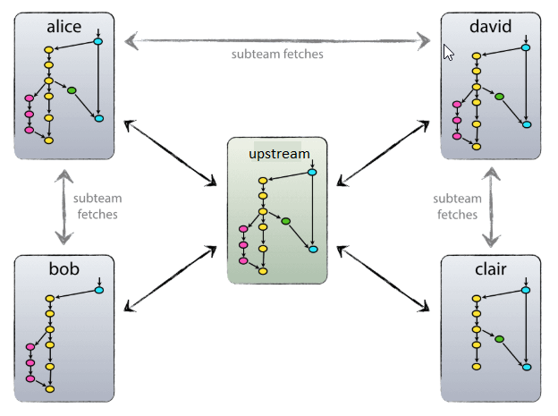

After forking the repo, the user (David for example) will have an exact copy of the repo up to that time (`origin`). Each user only needs to keep the `develop` branch from the main repo. Any `feature`, `release` or `hotfix` branch can be discarded in the user repo, as these represent temporary changes being done by the repo admins. `master` branch should not be different in the user repo than on the `upstream`, so it suffices to use the `upstream` one. Within their own repo, each user can work with their own practices. However, keep in mind the following points:
* Each user will add their own features to their own `develop` branch, but all of the users `develop` branches will eventually be merged together, so try to keep the commit history clean and informative.
* To ensure any new pull request on the `upstream` `develop` branch is not lost when merging, a pull must be done from the `upstream` `develop` branch to the `origin` `develop` branch before starting the new pull request. This pull can be done either with a merge or a rebase.
* When developing work for a project, one should use the approved `upstream` `master` branch. Usage of the `upstream` `develop` branch is allowed, but the user is responsible to ensure the code not yet approved is working as expected.
* Pull requests to the `upstream` `develop` branch should only have finished features. This includes working code, docstrings and (if possible) unittest structure. 
* `hotfix` branches can be created on the user repo and then the pull request can be made directly to the `upstream` branches. However, remember to start the branch from the `upstream` `master` branch!
* After a `hotfix` pull request has been accepted on the `upstream`, the user should pull the changes on the `upstream` `develop` to his own repo, ensuring that `hotfix` is also applied on the code on his repo.

&nbsp;
##### Summary of interactions between upstream and forked repo
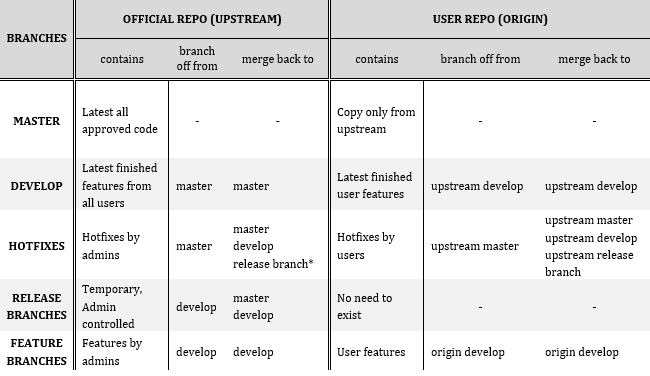

&nbsp;
### How to fork repository in BitBucket
1.	Go to the main repository page: [StandardPackage](https://git.mobi.mobicorp.ch/projects/TAG/repos/standardpackage/browse)
1.	On the left navigation bar choose `Create fork` 
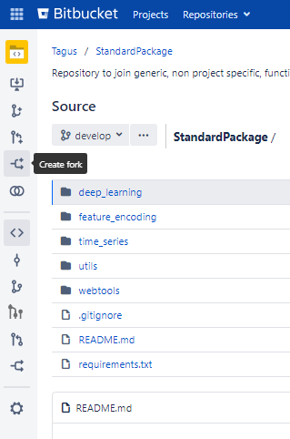  
1.	On the next page choose your own space in the `Project` field and a name for your own repo (keep the original name is possible, but make sure you can distinguish them). Keep the `Enable fork syncing` selected if you want common branches to be sync automatically from the `upstream` repo into your own repo (see downsides in the next topic). Finally hit `Fork repository` and the fork will be completed.

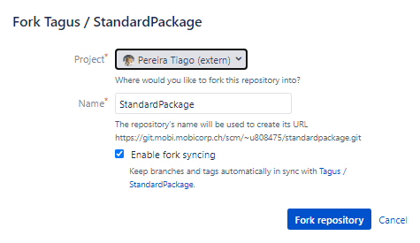
  
&nbsp;
### Clone the repository into your local machine
Once you forked the `upstream` repository you can now clone your own version into your local machine.  
1.	Grab the “clone” address from your repository webpage  
1.	Open IntelliJ on any project  
1.	Go to `VCS > Checkout from version control > git`  
1.	Paste the address  
1.	Choose the directory where to clone the repo into. It is recommended you create a new empty folder for this such that you get a final path like: `<general path>/<new_empty_folder>/<repo_name_folder>`

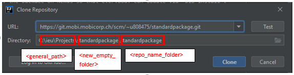
 Note: `<repo_name_folder>` will be automatically created from the clone command and will be added to the directory folder once you paste the address.

This structure will allow you to use this repo as a library later and import files/functions with the syntax: `import <repo_name_folder>` or `from <repo_name_folder> import <something>`

&nbsp;
### How to interact with repos on IntelliJ
You can either clone just your own repository or have both your own and the `upstream`”available in IntelliJ. 

* If you left the `Enable fork syncing` option selected then you most likely will not need to have both repos connected to IntelliJ and thus you can just clone your own repository and work with it as a regular project. This is possible because your own `develop` branch will detect changes on the `upstream` `develop` branch and sync automatically with it. However, it might oblige you to solve conflicts between the `upstream` `develop` branch and your own every time the `upstream` `develop` branch is updated.
* If, on the other hand, you disabled `Enable fork syncing` then it will be useful to have both repos connected into IntelliJ at the same time, as this will enable you to pull changes from the `upstream` repo before creating a pull request with your own changes.

To connect multiple repos within the same project in IntelliJ start by:  
1.  Cloning your own repo normally and open the respective project in IntelliJ.  
1.  Then, on the top navigation bar go to `VCS > Git > Remotes…`  
1.  Add the “clone” address as a new “remote”.  
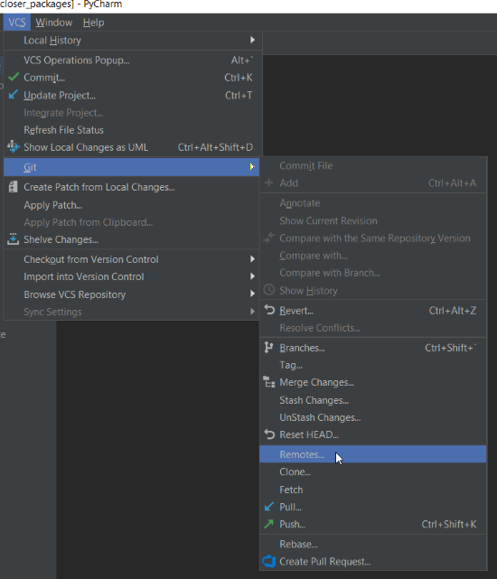  
1.  Name your remote repos (for sake of standardization between all users, you should name the main repo as `upstream` and your own repo as `origin`).    
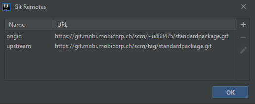  
 
Now, from the dropdown box on the bottom right of your IDE you can quickly access all branches in both repos (and also your own local branches)

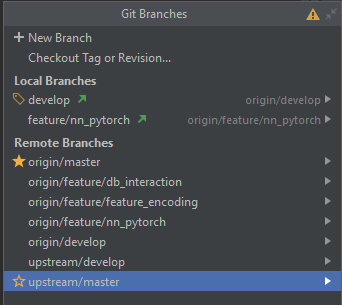  
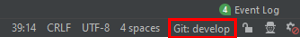  

&nbsp;
### Collaborate with work
The environment is all set up. 

Say you have recently created a code file that adds a new generic functionality that other people could use in their projects and you want to share it with the team. How can you do it? 

**1 - Checkout origin/develop locally**
* select `origin/develop` from the dropdown box presented in the last topic and check it out – using the same name is convenient). 
* If you already have checked out this branch before and have a version of it locally, checkout that local branch instead and perform a pull to guarantee you are synced with your own repo version of the branch.

    You should now have something like the following, where in the local branches you can see your new branch and at the right of its name which remote branch it is tracking. The dropdown box value (when not clicked) should be showing the name of your local branch.

    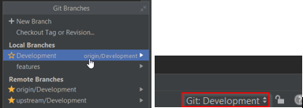

**2 - Update your origin and local branch with latest `upstream` changes**
* Navigating to `VCS > Git > Pull` and select the correct repo and branch to pull from as below. 

    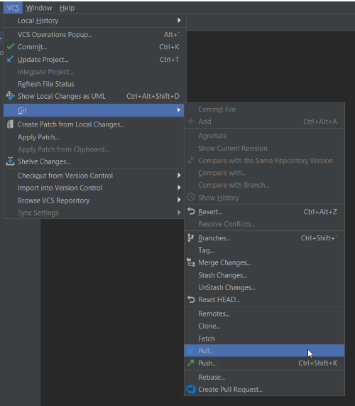
    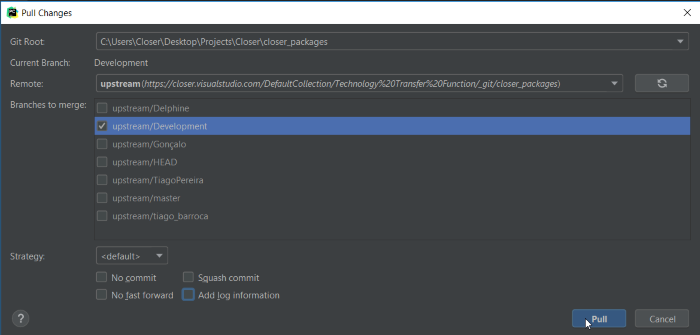

    This procedure ensure you are starting to work from the most updated version of the `develop` branch, which might already include changes since you last got it (If you have the `Enable fork sync` option this should already be up-to-date)

**3 - Create new feature branch**
* Make sure you have your `develop` branch selected when following the images below
* Select the `New Branch` option and give it a name so you can identify it as the local version of this branch (`Feature1` in the pictures)

    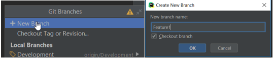

**4 - Create your feature code and commit it**

**5 - Merge feature back to `develop`**
* Position yourself in the `develop` branch and then head to `VCS/Git/Merge Changes`. 
* Choose which branch you are merging into `develop`
* Add a Commit Message
* Check the `No fast forward` checkbox (to ensure traceability)

    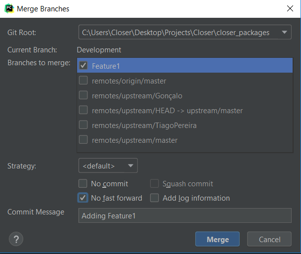
 
    The version control log shows this merge now (`Version Control/Log` in the bottom navigation pane in IntelliJ). 
    It is possible to see that a new branch named ‘Feature1’ was created, it had just one commit and then it was merged back into develop with the commit message ‘Adding Feature1’.
    
    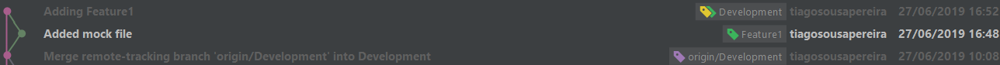
 
**6 - Share your code with the `upstream` repo**
* From your `develop` branch, pull any new changes from the `upstream` `develop` branch
* Solve any merge conflict, ensuring your changes don't break the code already in the `upstream` repo
* Re-test your feature to ensure it is working fine before merging it back into the `upstream` repo
* Push your `develop` branch into BitBucket (still your own repo - `origin`)
* In Bitbucket, open a new pull request from your repo `develop` into `upstream` `develop`.
* Add the necessary reviewers

**7 - Delete your local feature branch or continue adding more functionalities to this feature** 

&nbsp;

----
## Using StandardPackage in your project
While working on your projects you will be using code from this repo in them. There are two options and which you use depend on you and on your project phase.

&nbsp;
#### While developing
While developing a project it might be useful to use features that might still be under work. To enable this, you can add your `StandardPackage` project folder as a library on your current project python interpreter. This will allow you to import any file/function from within this repository just as if it were a package installed. Below you can follow the steps to allow this.

In IntelliJ, the setup of the package as a library is done as follows:
1.	Go to `File > Project Structure`
2.	Select `Libraries` on the left navigation pane
3.	Click the `+` on top and choose `Java` (don’t worry about this)
4.	Select the parent folder of your repo (not the folder with your repo name, but its parent!)
5.	Click `Ok` and you are good to go
 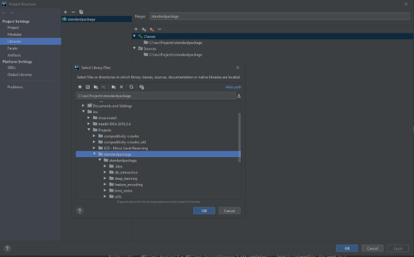
 
&nbsp;
#### When deploying a project
When you deploy a project, other people will be able to run it. However, they might not have the `StandardPackage` repo setup in their own local machine. This will break your project unless you provide this repo together with the project.

The way to ensure your project doesn't break is to include the `StandardPackage` package in the `requirements.txt` file with the current version you are using. 

If you are using any function that has not yet been deployed into a package, then you need to merge your changes into the `upstream` repo and push for a release into Nexus.

By ensuring these steps, any person with access to Nexus will be able to `pip install requirements.txt` and it will also install the version of the `StandardPackage` repo that the project was built with.
